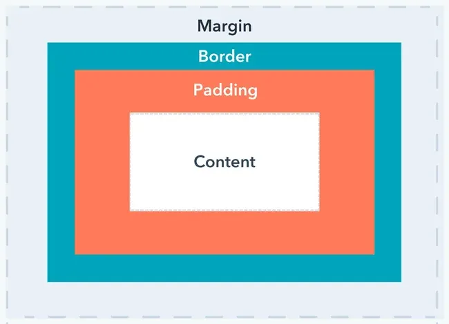

# Resumo CSS
## Texto e fontes
color → cor do texto
font-size → tamanho da fonte
font-family → tipo da fonte
font-weight → espessura (bold, normal)
text-align → alinhamento (left, center, right, justify)
```css
p {
    color: darkblue;
    font-size: 18px;
    font-family: Arial, sans-serif;
    text-align: justify;
}
```

## Cores e fundos
background-color → cor do fundo
background-image → imagem de fundo
background-size → como a imagem se ajusta
```css
body {
    background-color: lightgray;
}
```

## Caixas e espaçamentos
border → borda
margin → espaço externo
padding → espaço interno
```css
div {
    border: 2px solid black;
    margin: 20px;
    padding: 10px;
}
```

## Definindo o tamanho
width → define a largura do item
height → define a altura do item
box-sizing → o tamanho definito considera padding e borda


## Flex Container (div mãe)
1. display
display: block; → quebra a linha, aceita definição de tamanho
display: inline; → não quebra a linha, não aceita definição de tamanho
display: inline-block; → não quebra linha, aceita definição de tamanho
display: flex; → elementos filhos em linha

2. flex-direction (eixo principal)
row (padrão) → itens ficam lado a lado (da esquerda para a direita)
row-reverse → da direita para a esquerda
column → um embaixo do outro (de cima para baixo)
column-reverse → de baixo para cima

3. flex-wrap (quebra de linha)
nowrap (padrão) → tudo em uma linha só
wrap → permite quebrar linha se não couber
wrap-reverse → quebra linha mas invertendo a ordem vertical

4. justify-content (alinhamento no eixo principal)
flex-start (padrão) → encostados no início do eixo
flex-end → encostados no fim
center → centralizados
space-between → espaço só entre os itens
space-around → espaço ao redor dos itens
space-evenly → espaço igual entre e nas bordas

5. align-items (alinhamento no eixo cruzado)
stretch (padrão) → itens esticam até a altura/largura do container
flex-start → alinhados ao topo (ou esquerda no caso de coluna)
flex-end → alinhados embaixo (ou direita no caso de coluna)
center → centralizados
baseline → alinhados pela linha de base do texto

6. align-content (quando há múltiplas linhas de itens)
Só funciona se usar flex-wrap
flex-start, flex-end, center, stretch, space-between, space-around

## Flex Item (div filha)
1. order
Muda a ordem de exibição (padrão = 0)
Quanto menor o valor, mais à frente o item aparece

2. flex-grow (crescer)
Quanto o item pode crescer em relação aos outros
Ex: flex-grow: 1; → divide o espaço sobrando igualmente

3. flex-shrink (encolher)
Quanto o item pode encolher se faltar espaço
0 → nunca encolhe
1 (padrão) → encolhe proporcionalmente

4. flex-basis (tamanho inicial)
Define o tamanho base antes de aplicar grow/shrink
Pode ser em px, %, etc
Padrão: auto (usa width/height do item)

5. flex (shorthand)
Atalho para flex-grow flex-shrink flex-basis
Ex: flex: 1; → igual a flex: 1 1 0;

6. align-self (alinhamento individual no eixo cruzado)
Sobrescreve o align-items só para aquele item.
Valores: auto (padrão), flex-start, flex-end, center, baseline, stretch
